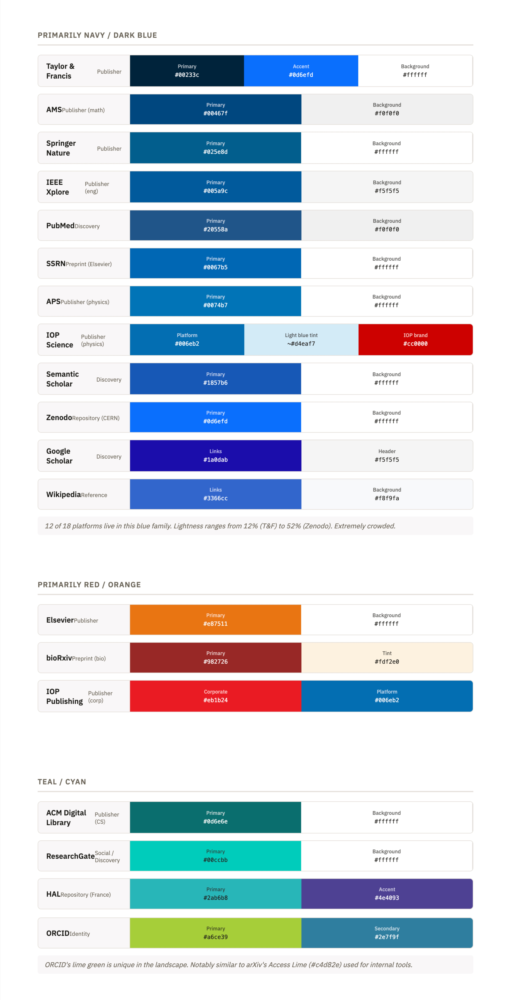

# Competitor brand-color analysis

**07/01/26. Shamsi Brinn.**

An audit of the primary brand colors used across the research-publishing ecosystem — publishers, preprint servers, repositories, discovery tools, and identity services — and what it means for arXiv's own palette.

## Findings

Most big players in the research publishing ecosystem have adopted a primary brand color in the navy blue family. And remarkably similar blues too: most of them are in the 200–212 hue range on the color wheel. Dark blues signal conservative authority, and these brands compete with each other for that brand attribute. arXiv, on the other hand, must balance two somewhat contradictory messages: establish legitimacy and stability within research publishing, and declare our independence from Cornell and industry norms.

### The landscape

**Primarily navy / dark blue — 12 of 18 platforms.** Lightness ranges from 12% (Taylor & Francis) to 52% (Zenodo). Extremely crowded.

| Platform | Category | Brand colors (role · hex) |
|---|---|---|
| Taylor & Francis | Publisher | Primary `#00233c` · Accent `#0d6efd` · Bg `#ffffff` |
| AMS | Publisher (math) | Primary `#00467f` · Bg `#f0f0f0` |
| Springer Nature | Publisher | Primary `#025e8d` · Bg `#ffffff` |
| IEEE Xplore | Publisher (eng) | Primary `#005a9c` · Bg `#f5f5f5` |
| PubMed | Discovery | Primary `#20558a` · Bg `#f0f0f0` |
| SSRN | Preprint (Elsevier) | Primary `#0067b5` · Bg `#ffffff` |
| APS | Publisher (physics) | Primary `#0074b7` · Bg `#ffffff` |
| IOP Science | Publisher (physics) | Platform `#006eb2` · Light-blue tint `~#d4eaf7` · IOP brand `#cc0000` |
| Semantic Scholar | Discovery | Primary `#1857b6` · Bg `#ffffff` |
| Zenodo | Repository (CERN) | Primary `#0d6efd` · Bg `#ffffff` |
| Google Scholar | Discovery | Links `#1a0dab` · Header `#f5f5f5` |
| Wikipedia | Reference | Links `#3366cc` · Bg `#f8f9fa` |

**Primarily red / orange.**

| Platform | Category | Brand colors (role · hex) |
|---|---|---|
| Elsevier | Publisher | Primary `#e87511` · Bg `#ffffff` |
| bioRxiv | Preprint (bio) | Primary `#982726` · Tint `#fdf2e0` |
| IOP Publishing | Publisher (corp) | Corporate `#eb1b24` · Platform `#006eb2` |

**Teal / cyan.**

| Platform | Category | Brand colors (role · hex) |
|---|---|---|
| ACM Digital Library | Publisher (CS) | Primary `#0d6e6e` · Bg `#ffffff` |
| ResearchGate | Social / Discovery | Primary `#00ccbb` · Bg `#ffffff` |
| HAL | Repository (France) | Primary `#2ab6b8` · Accent `#4e4093` |
| ORCID | Identity | Primary `#a6ce39` · Secondary `#2e7f9f` |

ORCID's lime green is unique in the landscape. Notably similar to arXiv's Access Lime (`#c4d82e`) used for internal tools.

## Resolution

arXiv's Open Blue as primary color finds this balance. By choosing a similar hue to other publishers we signal our place in the ecosystem. But the much brighter value makes it quite distinct and signals openness and transparency. Open Blue embodies arXiv's reputation as "the light side of the internet."

Repository Brown pairs beautifully with blue and is warmer than the black that most publishers favor. Lighter tints will create a distinctive blue-brown palette for arXiv that is both conservative and warm, traditional yet subversively bright.
