# arXiv Labs Audit

**Audited by:** Shamsi Brinn
**Date:** 2026-04-28
**Purpose:** Evaluate each Labs project for functionality, usefulness, and whether it belongs on the redesigned abstract page.

---

## Summary

| # | Lab | Tab | Working? | Useful? | Recommendation |
|---|---|---|---|---|---|
| 1 | Bibliographic Explorer | Bibliographic | Yes | Most used, most useful | Integrate directly into abs page |
| 2 | Connected Papers | Bibliographic | Yes | Yes | Keep — link to external site |
| 3 | Litmaps | Bibliographic | Yes | Yes | Keep — generic link, builds on demand |
| 4 | scite Smart Citations | Bibliographic | Broken | Potentially | Fix needed — DOI issue |
| 5 | alphaXiv | Code, Data, Media | Yes | Diminished | Requires login |
| 6 | CatalyzeX | Code, Data, Media | Yes | Yes | Keep — shows code links when available |
| 7 | DagsHub | Code, Data, Media | Broken | No | Consider removing |
| 8 | Gotit.pub | Code, Data, Media | Yes | Diminished | Requires login |
| 9 | Hugging Face | Code, Data, Media | Yes | Yes | Keep — shows paper-specific content |
| 10 | Papers With Code | Code, Data, Media | Should be removed | No | Ghost from old integration |
| 11 | ScienceCast | Code, Data, Media | Yes | Unclear UX | Visual-only, not clear it's a link |
| 12 | Replicate | Demos | Yes | Niche | Shows image + text when available |
| 13 | Hugging Face Spaces | Demos | Yes | Niche | Works as expected |
| 14 | TXYZ.AI | Demos | Degraded | Diminished | Requires login, flash-then-redirect |
| 15 | Influence Flower | Related Papers | Broken | No | Consider removing |
| 16 | CORE Recommender | Related Papers | Yes | Yes | Minor styling issue (needs top margin) |

---

## Detailed findings

### 1. Bibliographic Explorer (Bibex)
- **Tab:** Bibliographic Tools
- **Status:** Working
- **Assessment:** Most used and most useful of all Labs. Provides formatted citation export with style options.
- **Plan:** Incorporate directly into the abstract page — no extra clicks or popup needed. This is already reflected in the abstract-redesign mockup's "Cite this paper" section.

### 2. Connected Papers
- **Tab:** Bibliographic Tools
- **Status:** Working
- **Assessment:** Link takes user to Connected Papers site. No login required. Shows a graph preview with paper-specific content.
- **Example:** https://arxiv.org/abs/2604.24721

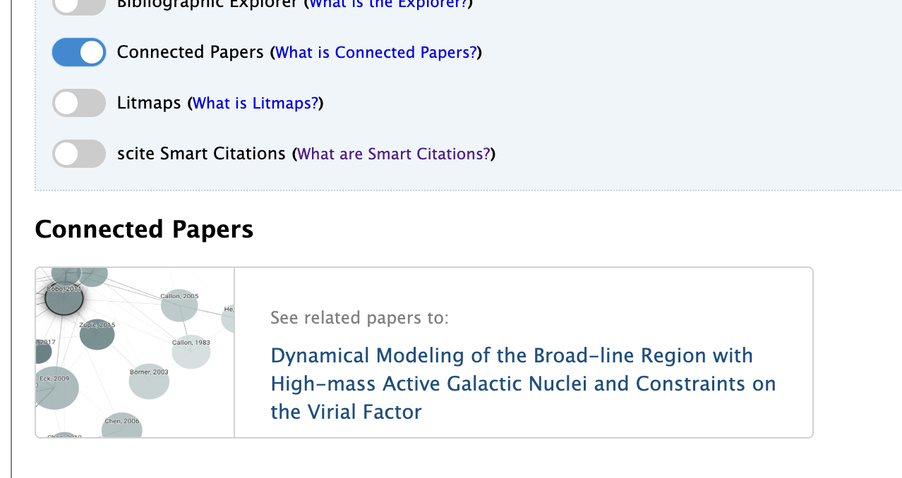

- **Plan:** Keep as a link in the Related section.

### 3. Litmaps
- **Tab:** Bibliographic Tools
- **Status:** Working
- **Assessment:** Displays a generic literature map image and link. Builds content on demand for any paper. Card-style display with Litmaps branding.
- **Example:** https://arxiv.org/abs/2302.13971v1

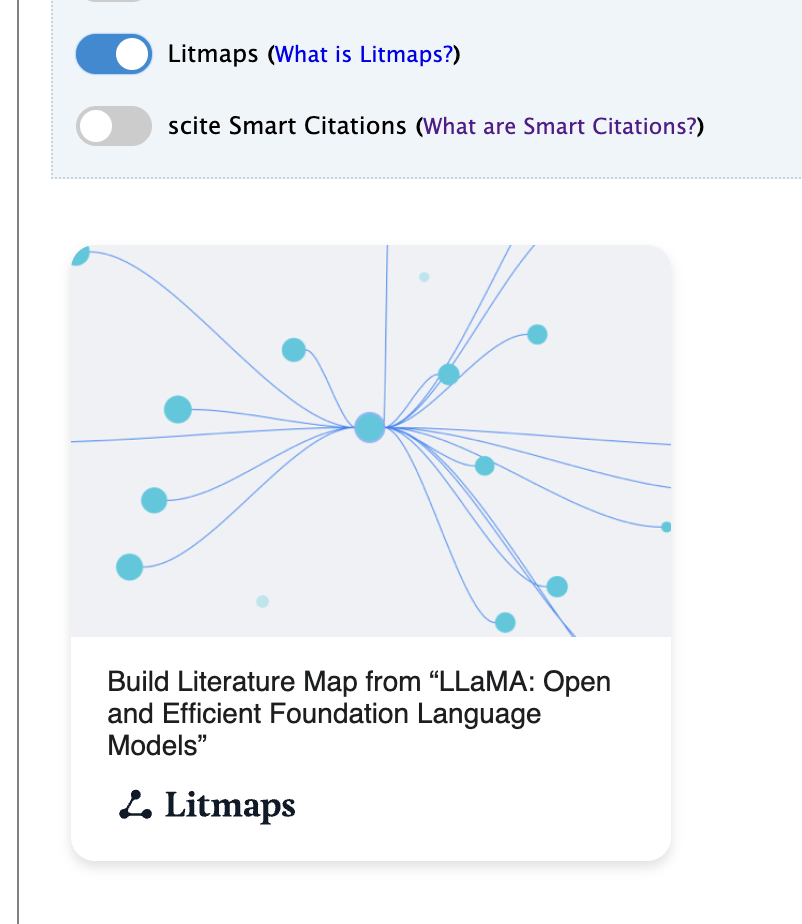

- **Plan:** Keep as a link in the Related section.

### 4. scite Smart Citations
- **Tab:** Bibliographic Tools
- **Status:** Not working as expected
- **Assessment:** Gives message "scite only processes publications with a DOI and there is no DOI available for this paper" even for papers with massive citation counts. The paper https://arxiv.org/abs/1706.03762 (Attention Is All You Need) has a huge number of citations but scite reports no DOI. The paper does have a scite report at https://scite.ai/reports/attention-is-all-you-need-LeQrj3pr — so the issue is on the arXiv integration side, not scite's.

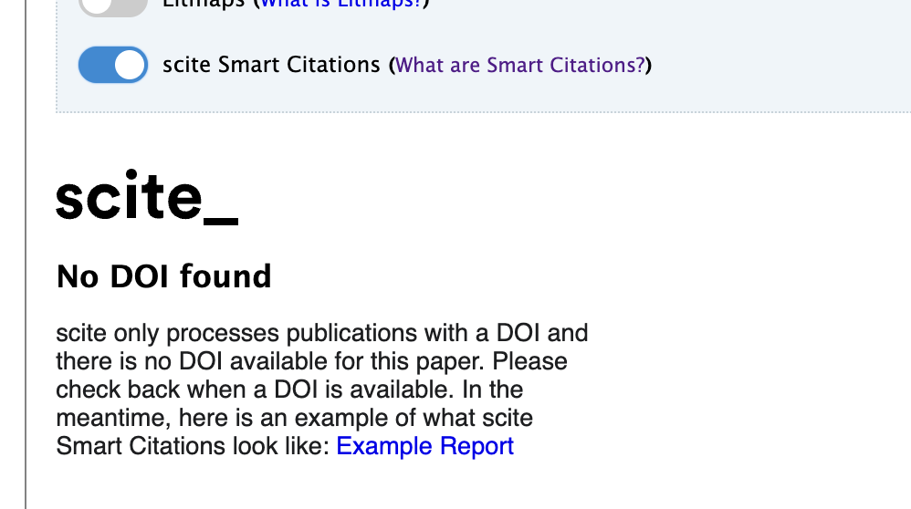

- **Plan:** Needs investigation. The DOI lookup may be failing. If fixable, scite's citation context (supporting vs contrasting) would be valuable in the References section.

### 5. alphaXiv
- **Tab:** Code, Data, Media
- **Status:** Working
- **Assessment:** Displays a generic link to view the paper on alphaXiv's platform ("Your personalized arXiv assistant"). Link is the same regardless of whether existing content is available. **Requires login to interact**, which diminishes usefulness.
- **Example (with annotations):** https://arxiv.org/abs/2604.21691

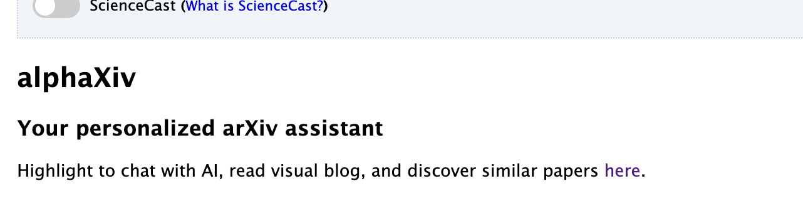

- **Plan:** Lower priority due to login requirement. Could be a link in Related but not prominently featured.

### 6. CatalyzeX (Code Finder)
- **Tab:** Code, Data, Media
- **Status:** Working
- **Assessment:** Displays a GitHub icon and link when code is available ("1 code implementation found on CatalyzeX"). Also includes a call-to-action for researchers to submit their code. Useful signal for researchers. Note: CatalyzeX's links back to arXiv from their site are hard to find.
- **Example:** https://arxiv.org/abs/2604.20452

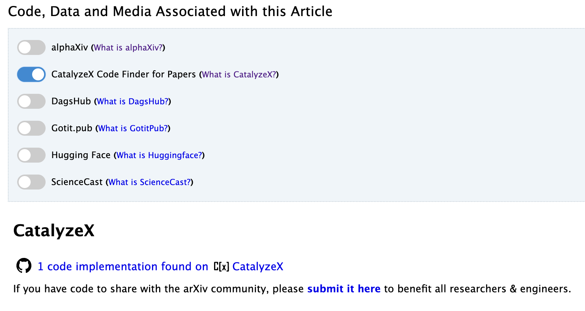

- **Plan:** Keep. "Code available" is a high-value signal. Consider promoting to action row or metadata when code exists.

### 7. DagsHub
- **Tab:** Code, Data, Media
- **Status:** Likely broken
- **Assessment:** Following the DagsHub link to linked arXiv papers shows an error: https://dagshub.com/explore/repos?topics=Integration%3Aarxiv&ref=dagshub.com. Even the paper DagsHub uses as their own example (https://arxiv.org/abs/1711.05225) shows nothing when the Lab is toggled on. Toggle is visible in the Code, Data, Media tab but produces no output.
- **Plan:** Consider removing. Integration appears non-functional.

### 8. Gotit.pub
- **Tab:** Code, Data, Media
- **Status:** Working
- **Assessment:** Displays conversation count and link to their platform ("There are 2 conversations for this paper on Gotit.pub"). **Requires login to interact**, which diminishes usefulness.

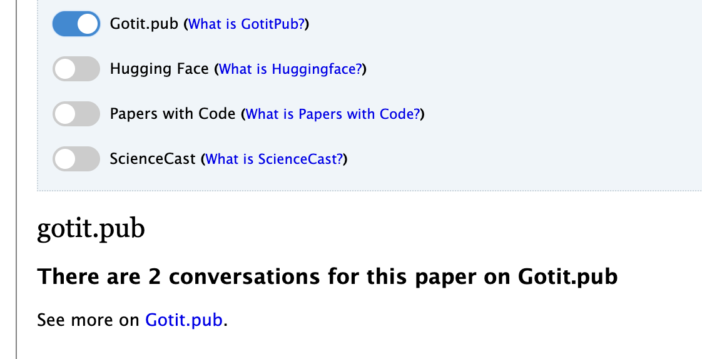

- **Plan:** Lower priority due to login requirement.

### 9. Hugging Face
- **Tab:** Code, Data, Media
- **Status:** Working
- **Assessment:** Displays paper-specific content when available — shows the paper card with title, authors, date, likes/comments, and a "View on Hugging Face" link. Also shows associated datasets with tags for language, license, format, and modality. Rich integration. Additionally, Hugging Face provides a CLI command (`hf papers read <arxiv_id>`) for their AI agent.
- **Example:** https://arxiv.org/abs/2602.17288

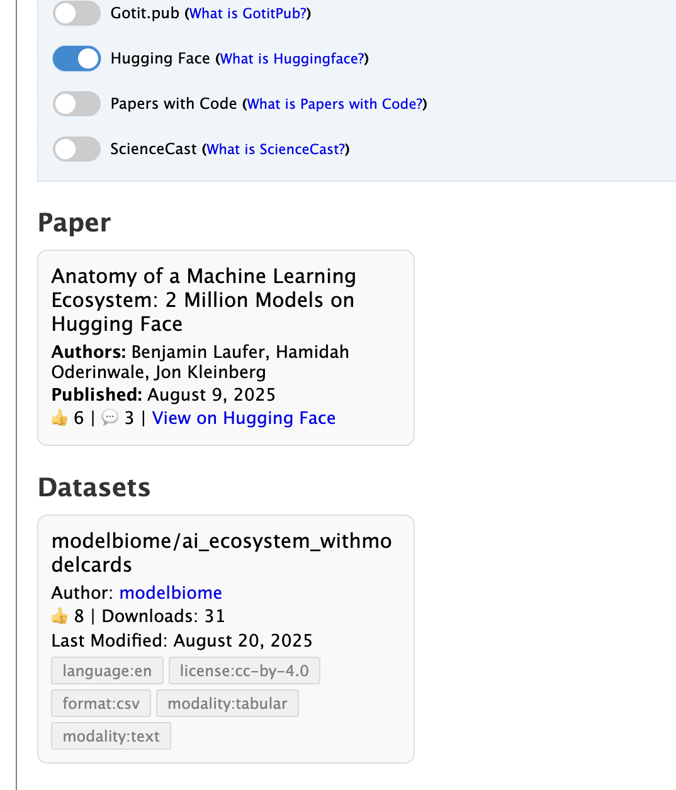

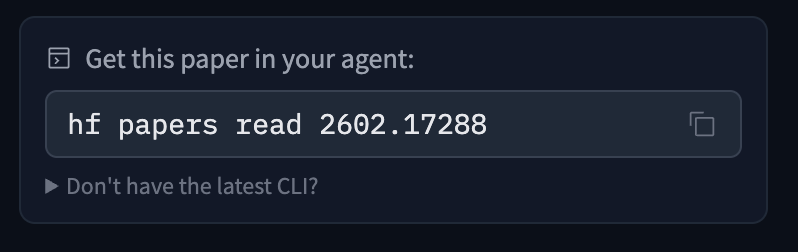

- **Plan:** Keep. Valuable for ML/AI papers. Consider showing in metadata or action row when HF content exists.

### 10. Papers With Code
- **Tab:** Code, Data, Media
- **Status:** Should be completely removed but still appears on some abstract pages
- **Assessment:** The toggle still appears in the Code, Data, Media tab on some pages. The "What is Papers With Code?" info link forwards to Hugging Face trending papers, suggesting the integration has been officially retired but remnants remain.
- **Example (still showing):** https://arxiv.org/abs/1706.03762

- **Plan:** Remove completely. Clear any cached assets.

### 11. ScienceCast
- **Tab:** Code, Data, Media
- **Status:** Working
- **Assessment:** Displays a grid of figure thumbnails under "Related ScienceCast" — visual only, no text description. It is **unclear that these visuals are clickable links** (they are). Poor affordance — a user would not know what to do with this display without prior knowledge of ScienceCast.
- **Example:** https://arxiv.org/abs/2604.24721

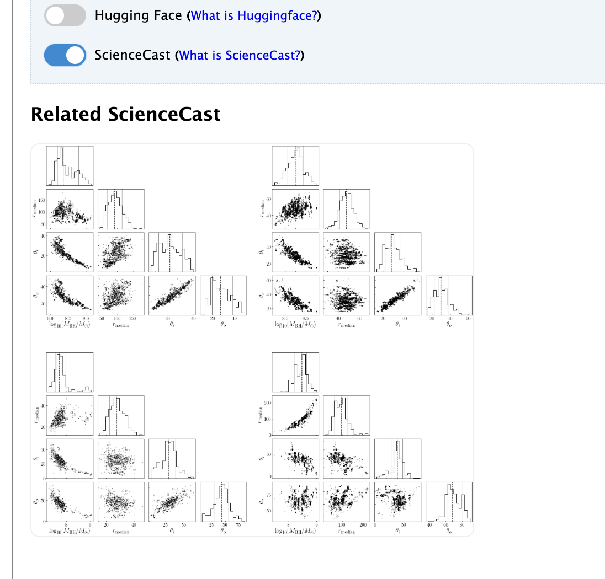

- **Plan:** Low priority. If kept, needs better link affordance (text label, hover state, or border).

### 12. Replicate
- **Tab:** Demos
- **Status:** Working
- **Assessment:** Displays clear text context ("@tencentarc has implemented an open-source model based on this paper. Run it on Replicate:") with a card showing the model name, description, preview image, and run count (113M+ runs). Good integration with clear affordance.
- **Example:** https://arxiv.org/abs/2101.04061

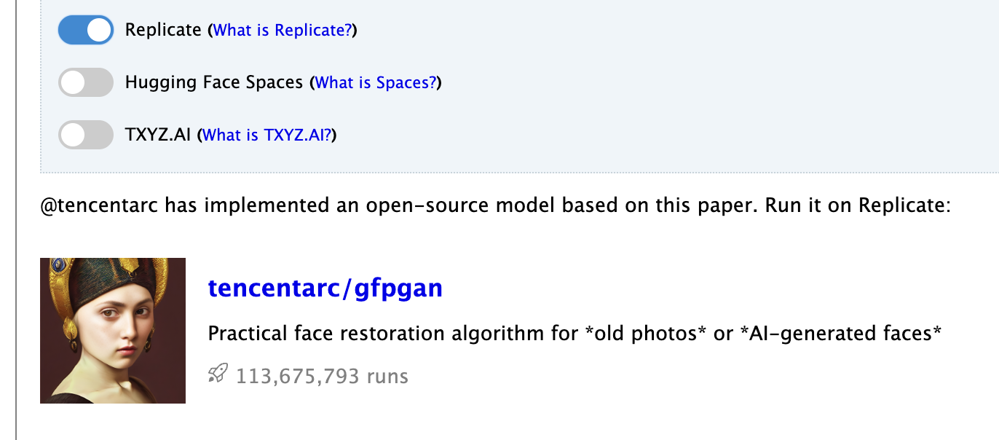

- **Plan:** Niche — only relevant for ML papers with runnable demos. Keep as a link if available, don't give prominent placement.

### 13. Hugging Face Spaces
- **Tab:** Demos
- **Status:** Working as expected
- **Assessment:** Shows count of available demos ("There are 100 open-source demos based on this paper. Run them on Spaces:") with a list of spaces including name, description, creation date, and framework type (static, gradio, docker). Well-structured display.
- **Example:** https://arxiv.org/abs/1706.03762

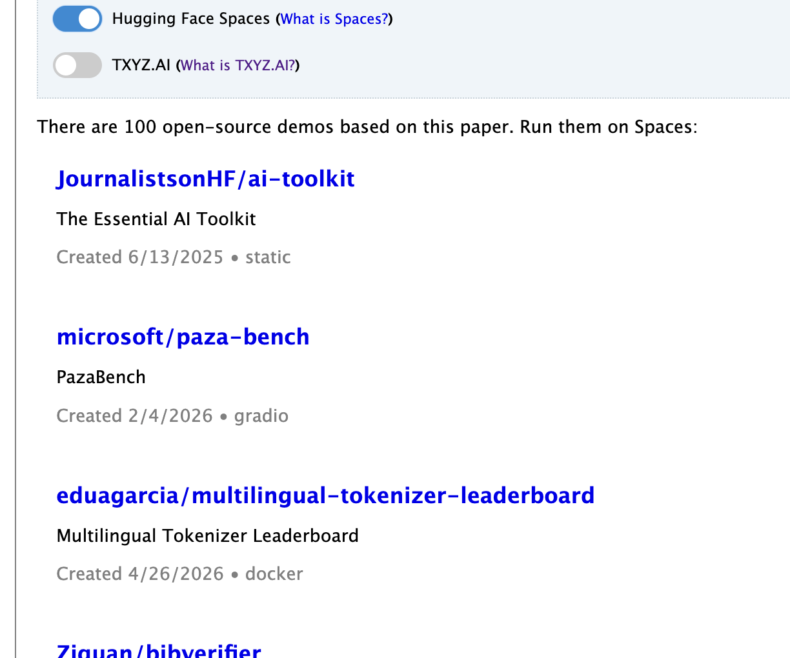

- **Plan:** Niche but functional. Similar to Replicate — link when available.

### 14. TXYZ.AI
- **Tab:** Demos
- **Status:** Degraded
- **Assessment:** Displays a generic link for any paper. **Requires login** when following the link — there is a flash of the paper content before being redirected to login, which may be a recent change. TXYZ's own demo page does not show a login step, suggesting this is new friction.
- **Example:** https://arxiv.org/abs/2101.04061

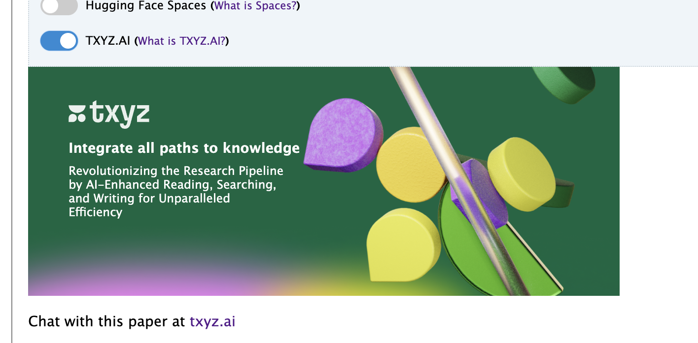

- **Plan:** Lower priority due to login requirement and degraded experience. Monitor.

### 15. Influence Flower
- **Tab:** Related Papers
- **Status:** Likely broken
- **Assessment:** Cannot find a working example. Even the project's own seminal paper (https://arxiv.org/abs/1907.12748) has no linked Influence Flower. The Influence Flower website has many non-functional links.
- **Plan:** Consider removing. Integration appears non-functional.

### 16. CORE Recommender
- **Tab:** Related Papers
- **Status:** Working as expected
- **Assessment:** Shows related paper recommendations in a clean list format with title, authors, date, and "Get PDF" links. Sources results from "arXiv.org e-Print Archive." Functional and useful.
- **Example:** https://arxiv.org/abs/2302.13971v1
- **Minor issue:** Display could use some top margin.

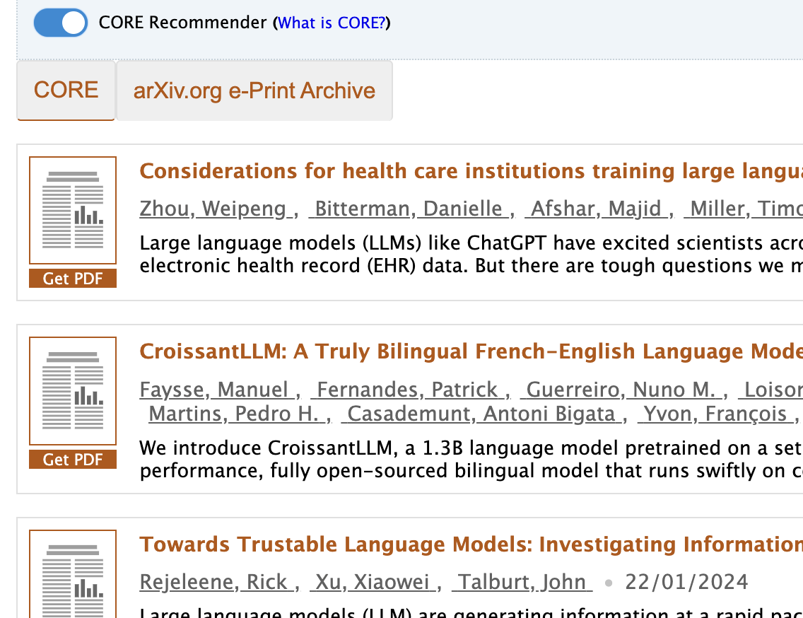

- **Plan:** Keep in Related section.

---

## Themes

**Login walls diminish value:** alphaXiv, Gotit.pub, and TXYZ.AI all require login to interact with content. This creates friction that conflicts with arXiv's open-access mission. Labs that require login should be deprioritized or flagged to their operators.

**Broken integrations need cleanup:** DagsHub, Influence Flower, and Papers With Code appear non-functional or retired. These should be removed to reduce clutter and maintenance burden.

**Best integrations are frictionless:** Connected Papers, Litmaps, Hugging Face, CatalyzeX, and CORE Recommender all work without login and provide immediate value. These are the Labs that belong on a redesigned page.

**Bibex is graduating:** The Bibliographic Explorer is the most-used Lab and its functionality is being incorporated directly into the abstract page's Cite section. It's no longer experimental — it's a core feature.
