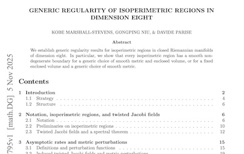
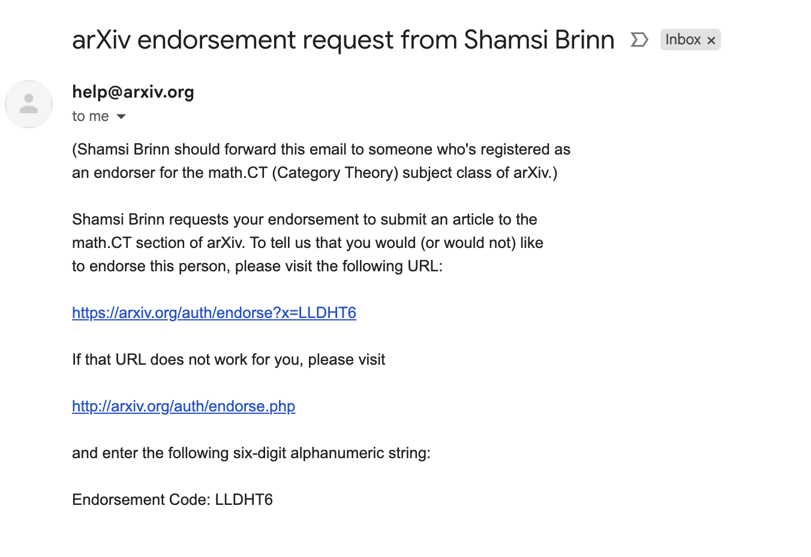
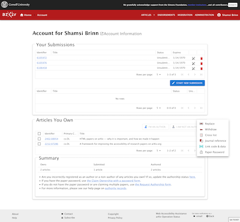
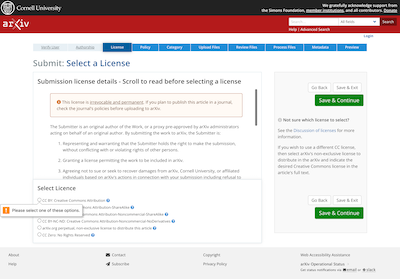
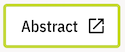
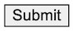
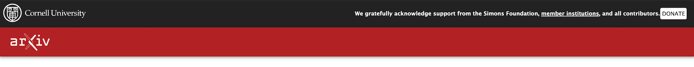
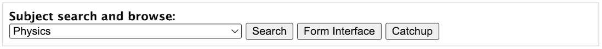
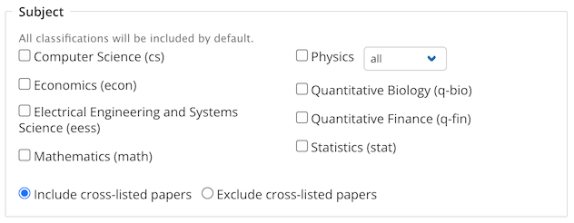

# Design Audit of the arXiv Platform

**Audience:** Internal arXiv Stakeholders\
**Prepared by:** Shamsi Brinn\
**Date:** 11/11/2025

## 1. Executive Summary

This audit revealed the extent of visual inconsistency across our systems. **arXiv's visual identity is made up of a patchwork of distinct, conflicting, incomplete, and fragmented visual languages.** 

The lack of a "single source of truth" for design results in a high level of inconsistency for layouts and critical components like **Buttons**, **Forms**, and **Navigation**. The inconsistent, confusing, and dated user experience errodes trust. On the development side it directly increases technical debt and slows down front-end development. Poor UI and HTML in forms also lowers data quality at the point of collection. We are also not in compliance with Federal accessibility requirements, work that requires specialized knowledge applied consistently across all UIs.

We can turn it around with a single, unified Design System. The redesign goes beyond a simple "reskin." It is a **unification project** to replace our patchwork of visual languages and code with a single, modern Design System that is consistent with our **values** (useful, open to all, fast-loading) and **goals** (improve user experience and speed up development).

The timing is right. As arXiv spins out into a 501c3 it will no longer need to comply with Cornell Tech brand guidelines or balance two primary logos in the header.

> The short story: arXiv's design is highly inconsistent. The current state is bad for users and data quality and slows development. A unified design system is a foundational necessity for the platform's future, and the time to build it is now.

 
 

## 2. The 11 Visual Languages We Currently Maintain

This audit identified *eleven* distinct (though incomplete) visual languages, each with its own colors, components, and layouts. Even similar-looking elements are handled by unrelated code in different languages and are inconsistent.

*Note: For the audit I reviewed newer versions of Submit and Accounts, because they will be replacing legacy within a reasonable amount of time*

| **Description** | **Example** |
| :--- | :--- |
| **Browse**: These pages are arXiv's most visited and have the greatest impact on the user experience as well as building the brand. They feature the 'standard' double red & black header, browser default link colors, Lucida font, and the use of tables for content organization. |  |
| **Search**: These pages were built more recently than Browse, in the 'NG' era. They use a different version of the red & black header and the Open Sans font. New UI elements were introduced including tag chicklets, colors, and cards. | |
| **Super-legacy Forms**: Some of the oldest legacy code on arXiv can be found in forms that are still in use, immediately distinguished by the massive sans serif "arXiv.org" title in lieu of the logo, and their 90s-styled form inputs. |  |
| **arXiv Check**: arXiv Check introduces a right panel and reliance on accordions, and a color pallete that highlights access lime from the brand guide. Uses font IBM Plex Sans, our secondary brand font. Layouts and components have Bootstrap inffluence. Has dark mode, is responsive, accessibility is fair. |  |
| **Admin Console**: This new system has some overlap with arXiv Check styles and we are working on bringing both systems closer together. This system introduces a right sidebar and shows strong Material UI inffluence. Has dark mode, is responsive, accessibility is fair. |  |
| **HTML pages**: The HTML paper pages were introduced a few years ago, relying mainly on student and new developer work. The header reinforced a 'in-progress' message which we are now ready to retire. It has a dark mode, is responsive, and accessibility is high. It uses the Rival Sans font with STIX Two for math and shows ar5iv stylistic inffluence. |  |
| **PDF**: The look and feel are user-determined and vary. The arXiv watermark is our sole branding element on PDFs and—for reasons that are lost in the mists of time—uses the Times Roman font. |  |
| **Info site**: The mkdocs-based sub site introduces a 3-column layout and a new version of the black & red header. It uses arXiv's brand fonts of Freight Sans Pro and Freight Text Pro. It also adds navigation, in-page section nav, and it's own search. It includes arXiv's first dark mode and is responsive and accessible. |  |
| **Transactional Emails**: Emails are also a canvas for consistent branding. Setting content entirely aside, arXiv system emails have no branding even in text form, leaving them feeling 'unsigned' and un-anchored. |  |
| **Accounts and Login**: The account and registration pages have an emerging design style that is still in progress. They introduce breadcrumb navigation in the header, simplify the user flow, and feature modern form components and validation. |  |
| **Submission**: The code and styling is from the NG era but modified recently to accomodate newer changes to submission functionality and content. The NG design introduces a prominent stepper, 2 column layout, box shadows, green primary buttons, and more modern form elements (but not consistent with the account and login form elements). |  |

 
 

## 3. Examples

### Buttons
A platform's button is the single most critical component. As the primary user flow signal, it should be consistent across all areas of arXiv that a users group access. But the only consistent aspect of arXiv's buttons styles is their inconsistency!

Users should never have to hunt around for or guess what the primary action on a page looks like. The visual fragmentation in arXiv buttons damages user trust, and is the first component being addressed by the new design system.

| **Description** | **Example** |
| :--- | :--- |
| **Abstract and HTML**: The single most performed action on our site is to view a PDF. At desktop widths, it is a simple 90s style text link using the browser default color. At mobile it takes on button styling. HTML pages, linked to from Abs, shift to the red button style. |    |
| **User Account**: The new user accounts use the first two buttons styles for primary and secondary. The third button style is from the existing user account page, included as an example of how quickly new visual styles are born without a standard Design System. |    |
| **arXiv Check and Admin Console**: We are working to bring arXiv Check and Admin Console in line with each others visual languages to improve efficiency for the EUST. It is a work in progress, but visible here is the prominence of the Access Lime color that distinguishes moderation tools from other parts of the site (an example of strategic inconsistency). |      |
| **Info site**: The info site heavily relies on text links, but when we use buttons they have this style. Though consistent with our brand guide it is inconsistent with other parts of the system. |  |
| **Legacy**: You will still come across legacy code in some parts of the arXiv platform that fall back to browser default styles, including the catchup form prominently above the fold on the arXiv homepage.  |  |
| **Submission**: The new Submit 2.0 introduces green primary action buttons and a subtle secondary button style. Submit 2.0 has more complex button needs than other parts of the site (for example it uses both disabled and processing states) and moving forward it should lead the Design System's level of button complexity. |  |
| **Search**: This button style, though blue like on some other parts of the site, has a different color, font, and margins than the blue buttons on user account, info site, and abs. |  |
| **Special**: Sometimes used in the header on browse to draw attention to limited-time messages, like Giving Week or the annual survey. |  

---

### Headers
A user should always know where they are and headers (along with navigation and breadcrumbs) provide that mental map. arXiv uses many different header and navigation styles, providing no consistent wayfinding or brand anchor for our users.

The new Design System will introduce a shared header with the right amount of customization to balance the needs of arXiv's different platform sections. It will include navigation and search elements, branding, and other content deemed strategically necessary.

#### Seven unique Black & Red headers
Though these headers have some visual similarities they all use different code. Note the content and style difference in the logo, breadcrumbs, thank you message, donate link, and search. 

*Account*

*Browse*

*Category Taxonomy*

*Info*

*Login*

*Submit*

*Endorsement*

#### Admin and Moderation Headers
*arXiv Check*

*Admin Console*

---

### Forms
After buttons, form inputs are the most important interactive element. They play a critical role in data quality and legal compliance by increasing user comprehension and accessibility. arXiv's platform currently waffles between a variety of custom styles as well as browser defaults in our forms, and accessibility is low.

This inconsistency is a classic sign of high technical debt. With no shared design system, new front end work usually meant introducing new styles instead of reusing existing components. The Design System will make it easy to build forms with high usability and accessibility, and that are consistent with our brand guidelines.

| **Description** | **Example** |
| :--- | :--- |
|  **Browse**: The forms in this section can both be seen on the homepage: the catchup form and search in the header. Each employs it's own styles without refences to the other's visual language. And both predate arXiv's brand guidelines. |    |
|  **Submission**: These styles are from the NG era. They are more modern, and have improved usability and accessibility over Browse, but also add to the visual and design patchwork. |   |
|  **Account pages**: This is some of our most recent and modern code and probably our most accessible forms to date. But without a Design System to build on they are heavily influenced by Material UI rather than arXiv's brand guidelines. |   |
|  **Legacy**: Not much to say here! These legacy forms fall back to browser default styles. They are surprisingly compatible with screen readers but usability is low. |   |
|  **HTML Papers**: This is our only form on the HTML papers page, but is a good example of how the lack of a Design System leads to a vacuum in which new visual languages get created ad hoc. |   |
|  **Search**: These styles share the most with Submit 2.0, as they are both NG era. But there are still significant differences between them and they do not have a shared underlying base so will likely diverge more as time goes on. |   |

 
 

## 4. Conclusion & Path Forward

The visual evidence is clear: the platform is suffering from severe design fragmentation. This is not a simple "visual cleanup" project; We need a **single, unified design system** that we can apply across our systems, and that maintains the right balance of consistency and flexibility to meet the needs of each repository.

### Next Steps

1.  **Form a Design System team:** Done! A dedicated team has been formed (Carly, Deyan, Shamsi) with the authority and resources to own the new design system. We have been meeting for several months, and though time resource allocation is low, are making steady progress.
2.  **Focus on high value components:** The first step of the team is to roll out our most high value component: **The Button**. This will be a right-sized proof of concept for the design system framework, as well as an opportunity for the dev team to see it in action and provide feedback. 
3.  **Expand the Design System to more components:** The next priority is a significant expansion of the Design Systsem: the global **Header** and **Footer** to be used across the platform. The header, for example, will need to be customizeable, mobile optimized, and include multiple components (links, forms, nav, logo, message boxes). After that we will tackle **Forms**, then remaining components.
4. **Complete the *visual* design system:** Simultaneously with #3, we will be making decisions about the visual display of components and layouts and coherence with our values:  utilitarianism, usability, fast page load, internationalization, and accessibility. All design decisions will be embedded directly into the Design System so they can be deployed everywhere, consistently, and with relatively low dev effort.
4.  **Integration:** Systematically apply the Design System to each repository once that repo code is moved to the cloud. Implementation order will probably follow which code is ready (ie: Submit and Wombat) rather than prioritizing our most high traffic systems (Browse and HTML papers).

> The implementation of the Design System will reduce technical debt, ease development pain, and—most importantly—provide a coherent, professional, and trustworthy experience for users.

 
 
