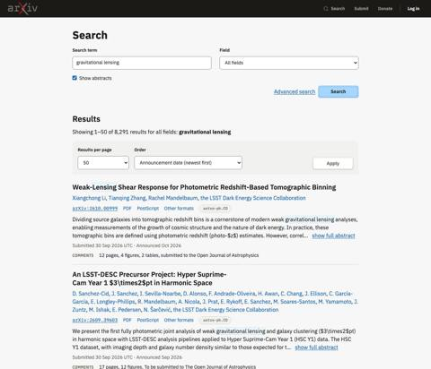
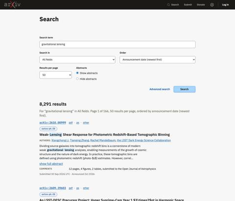
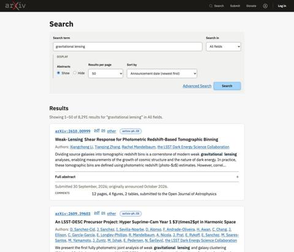
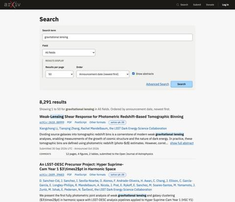
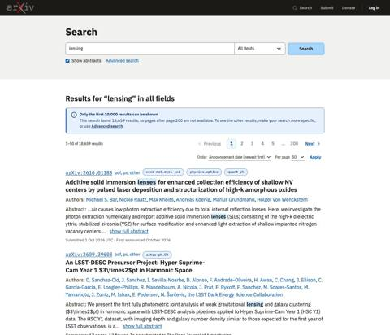
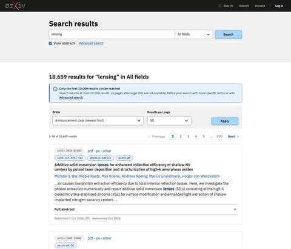
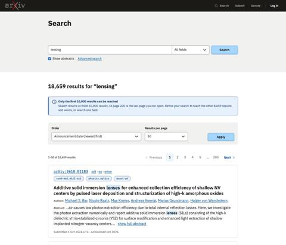
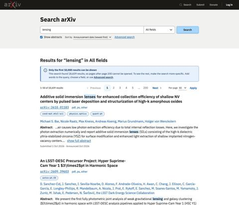

# Agent build tests: search, October 2026

Two rounds of testing on arXiv's search page, 2 October 2026. This report is for the arXiv team; the full records are linked at the end.

## What we are testing

Can an AI coding agent, given only the design system, build an arXiv page that our designer accepts and that follows the design system's rules? Every arXiv developer uses a coding agent, so the design system has to work for agents as well as for people. When an agent gets something wrong, we treat it as a gap in the documentation and fix the documentation.

## How a test works

1. We write a short brief for a page in plain product terms. It names no design-system components, so it cannot hand the agent the answer.
2. Four agents build the page separately: two with Claude Sonnet 5.5 and two with Claude Opus 5.5. Each works in a clean copy of the design system and never sees the test notes or earlier results.
3. Automated checks look at every build: accessibility rules, contrast in light and dark mode, layout on a phone, keyboard focus, pages without JavaScript, styles outside the design system, and anything loaded from another site.
4. Shamsi reviews each build without knowing which model made it, and gives a verdict: accept, accept with changes, or reject.
5. We change the design system based on what both reviews found, then test again.

## Round 1: simple search

The brief asked for the search page in three states: results, no results, and an invalid search.

| Build A (Opus) | Build B (Sonnet) | Build C (Sonnet) | Build D (Opus) |
|---|---|---|---|
|  |  |  |  |
| Reject | Reject | Reject | Reject |

**Result.** All four builds passed the automated checks, and Shamsi rejected all four. The agents followed the rules; the design system simply had no pattern for a compact search form, so each agent invented its own, and none of them was right.

**What we changed.**

- A compact form for very short forms such as search: the search field and the field list joined, the button on the same row, and options underneath.
- White as the default page background, with a tinted band added only where it is wanted.
- Clearer dropdown arrows and sort arrows.
- Styles for highlighted search matches and for paper dates.
- Numbered pages, with the current page clearly marked.

## Round 2: search results

The same search, on one page only: the results.

| Build A (Opus) | Build B (Sonnet) | Build C (Sonnet) | Build D (Opus) |
|---|---|---|---|
|  |  |  |  |
| Accept with changes | Accept with changes | Accept with changes | Accept with changes |

**Result.** Every build used the new compact form, page numbers and match highlighting as documented, and again passed the automated checks. All four were accepted with changes. What was left was design, not rule-following: where the sort and results-per-page settings go, how to separate the page numbers from the results, and how to tell one result from the next.

**What we changed after round 2.**

- A search page now stays on a white background; a heading names the search, and tinted bars with the page numbers sit above and below the results.
- Sort order and results per page sit with the search, not with the page numbers.
- A new Papers page: the order in which a paper's details appear in a list, based on what arXiv readers have told us, and how a paper looks in search results.
- A new Search page that puts a search page together from the existing parts.
- Tooltips that stay on screen on a phone.

## What we learned about the agents

- **Documentation, not the model, decides the result.** In both rounds, Sonnet and Opus made the same kinds of mistakes, and they made them where the documentation was silent or contradicted itself.
- **Sonnet is good enough.** The build Shamsi preferred in round 1 was a Sonnet build, and in round 2 the Sonnet builds were as conformant as the Opus builds.
- **Cost.** A build cost between $1.71 and $3.28 in estimated token cost, and most took 6 to 8 minutes. Opus builds cost more.
- **Contradictions get noticed.** In round 2, two agents found that two pages of the design system disagreed about where results per page goes, and chose differently. We fixed the contradiction.

## What is next

- Round 3 rebuilds the search results page once the Papers page is settled, to confirm the round 2 changes work.
- After that, a search in an internal tool, arXiv Check, to test which search rules hold beyond papers.

## Full records

- Round 1 summary, with every build's checks and notes: [`runs/20261002-143816-01-search-simple/`](../../runs/20261002-143816-01-search-simple/)
- Round 2 summary: [`runs/20261002-194317-02-search-results/`](../../runs/20261002-194317-02-search-results/)
- The testing plan: [`whiteboard/planning/TESTING-PLAN.md`](../../../../whiteboard/planning/TESTING-PLAN.md)
- How a test works, in detail: [`verification/token-burn/README.md`](../../README.md)
