# A Visual Audit of the arXiv Platform

**Prepared for:** arXiv Stakeholders
**Prepared by:** Shamsi Brinn
**Date:** 11/10/2025

## 1. Executive Summary

The audit reveals the extent of arXiv's inconsistent interfaces: **arXiv's visual identity is made up of a patchwork of distinct, conflicting, incomplete, and fragmented visual languages.** The lack of a "single source of truth" for design results in a high level of inconsistency in layouts and user flow, as well as critical components like **Buttons**, **Forms**, and **Navigation**.

**The Impact:** An inconsistent, confusing, and dated user experience that errodes trust. On the development side it directly increases technical debt and slows down front-end development. Poor UI and HTML in forms also lowers data quality at the point of collection.
**The Path Forward:** We can turn it around with a single, unified design system applied across all of arXiv. A redesign is not a simple "reskin." It is a **unification project** to replace the patchwork of 8 systems with a single, modern design system that is consistent with our values (utilitarian, international, fast-loading) and goals (improve user experience and speed up development).

*Note: For this audit I reviewed newer versions of systems if they will be replacing legacy in a reasonable amount of time and with a resonable degree of certainty. ie: Admin Console, new Account and Registration, new Login, and Submit 2.0.*

> The short story: arXiv's design is highly inconsistent. The current state is bad for users and data quality and slows development. A unified design system is a foundational necessity for the platform's future.

## 2. The 11 Visual Languages We Currently Maintain

This audit identified *eleven* distinct (though incomplete) design systems, each with its own visual language, components, and layout. They are often mixed and matched on the same page.

| **Description** | **Example** |
| :--- | :--- |
| **Browse**: These pages are arXiv's most visited and have the greatest impact on the user experience as well as building the brand. They feature the 'standard' double red & black header, browser default link colors, Lucida font, and the use of tables for content organization. | 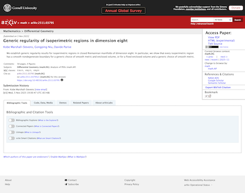 |
| **Search**: These pages were built more recently than Browse, in the 'NG' era. They use a different version of the red & black header and the Open Sans font. New UI elements were introduced including tag chicklets, colors, and cards. | 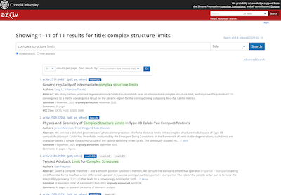|
| **Super-legacy Forms**: Some of the oldest legacy code on arXiv can be found in forms that are still in use, immediately distinguised by the massive serif "arXiv.org" title in lieue of the logo, and their 90s-styled form inputs. | 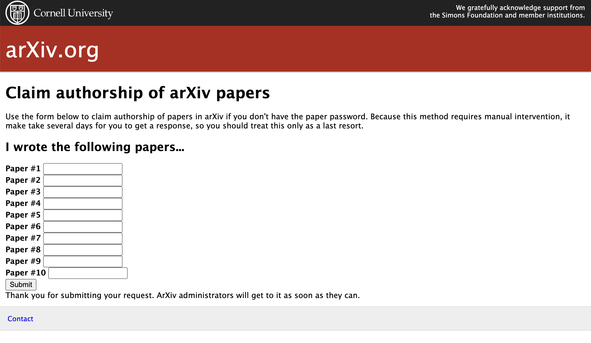 |
| **arXiv Check**: arXiv Check introduces a right panel and reliance on accordions, and a color pallete that highlights access lime from the brand guide. Uses font IBM Plex Sans, our secondary brand font. Layouts and components have Bootstrap inffluence. Has dark mode, is responsive, accessibility is fair. | 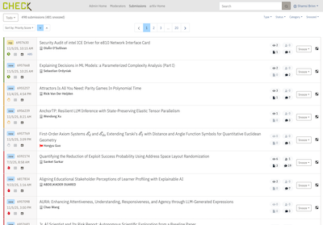 |
| **Admin Console**: This new system has some overlap with arXiv Check styles and we are working on bringing both systems closer together. This system introduces a right sidebar and shows strong Material UI inffluence. Has dark mode, is responsive, accessibility is fair. | 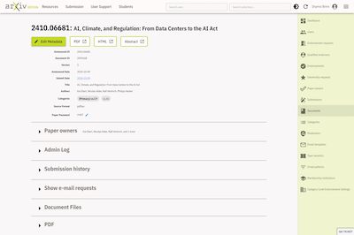 |
| **HTML pages**: The HTML paper pages were introduced a few years ago, relying mainly on student and new developer work. The header reinforced a 'in-progress' message which we are now ready to retire. It has a dark mode, is responsive, and accessibility is high. It uses the Rival Sans font with STIX Two for math and shows ar5iv stylistic inffluence. | 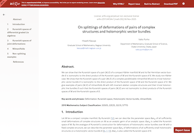 |
| **PDF**: The look and feel are user-determined and vary. The arXiv watermark is our sole branding element on PDFs and uses a serif font (is it Lucida?). |  |
| **Info site** | The mkdocs-based sub site introduces a 3-column layout and a new version of the black & red header. It uses arXiv's brand fonts of Freight Sans Pro and Freight Text Pro. It also adds navigation, in-page section nav, and it's own search. It includes arXiv's first dark mode and is responsive and accessible. | 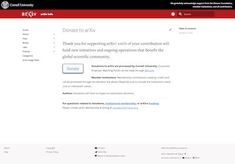 |
| **Transactional Emails**: No branding, system fonts, plain HTML. |  |
| **Accounts and Login**: Emerging design style, introduces navigation, simplifies header |  |
| **Submission**: The code and styling is from the NG era but modified recently to accomodate newer changes to submission functionality and content. It introduces a prominent stepper, 2 column layout, box shadows, green primary buttons, and more modern form elements. |  |

---

## 3. Examples

### Buttons
A platform's button is the single most critical component. As the primary user flow signal, it should be consistent across all areas of arXiv that a users group access. But the only consistent aspect of arXiv's buttons styles is their inconsistency!

| **Description** | **Example** |
| :--- | :--- |
| **Abstract and HTML**: The single most performed action on our site is to view a PDF. At desktop widths, it is a simple 90s style text link using the browser default color. At mobile it takes on button styling. HTML pages use the third button style. |    |
| **User Account**: The new user accounts use the first button style, the current account uses the second style. |    |
| **arXiv Check and Admin Console**: We are working to bring arXiv Check and Admin Console in line with each others visual languages because this will improve efficiency for the EUST. |   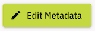  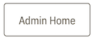 |
| **Info site**: |  |
| **Legacy**: |  |
| **Submission**: |  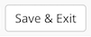|
| **Search**: |  |
| **Special**: Used in the header on browse to draw attention to limited-time messages, like Giving Week or the annual survey. | 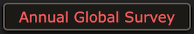 

> Users should never have to hunt around for or guess what the primary action on a page looks like. The visual fragmentation in arXiv buttons damages user trust, and is the first component being addressed by the new design system.

---

### Forms
After buttons, form inputs are the most common interactive element. Forms play a critical role in data quality by increasing user comprehension and accessibility. arXivs platform currently waffles between a variety of custom styles and browser defaults.

#### Checkboxes
| **Custom Blue Checkbox** | **Native Browser Checkbox** |
| :--- | :--- |
| `(Image: account-login.jpg)` | `(Image: submit-verify.jpg)` |

#### Text Inputs
| **New Auth** | **Admin Console** | **Legacy** |
| :--- | :--- | :--- |
| White background, thin gray border. | Light gray background, no border. | 3D `inset` border, white background. |
| `(Image: account-login.jpg)` | `(Image: admin-console-memb-inst.jpg)` | `(Image: claim-with-paper-password.png)` |

> This inconsistency is a classic sign of high technical debt. With no design system, new front end work usually meant introducing new styles instead of reusing existing components.

---

### Headers
A user should always know where they are and headers (along with navigation and breadcrumbs) provide that mental map. arXiv uses many different header and navigation styles, providing no consistent wayfinding or brand anchor.

| **Browse** | **Older browse** | **?** |
| :--- | :--- | :--- |
| ? | ? | ?|
| `(Image: admin-console-dashboard.jpg)` | `(Image: account-user-page.jpg)` | `(Image: info-policies.jpg)` |

| **Admin Console** | **New Account page** | **Info site** |
| :--- | :--- | :--- |
| Light gray, "ADMIN" logo, right-nav. | Black top bar, main red bar, `user` sub-nav. | Red bar *with search embedded in it*. |
| `(Image: admin-console-dashboard.jpg)` | `(Image: account-user-page.jpg)` | `(Image: info-policies.jpg)` |

| **HTML pages** | **arXiv Check** | **Super-legacy** |
| :--- | :--- | :--- |
| Minimal dark gray/black bar. | Light gray bar, "CHECK" logo. | No header, just a massive serif title. |
| `(Image: browse-html.jpg)` | `(Image: check-home.png)` | `(Image: endorsement-form-for-endorsER.png)` |

---

## 3. A "Frankenstein" Page

Many pages are built by "stitching together" components from multiple systems. This creates an incoherent and jarring user experience.

The screen `you-are-not-endorsed.png` is a perfect example, combining **five different visual styles** into one view:

1.  **Header:** From **System 2** (Public-Facing).
2.  **Stepper:** A new, text-based `>>` style. **(Style 1)**
3.  **Error Banner:** A new, red banner style. **(Style 2)**
4.  **Section Headers:** New, solid-red background headers. **(Style 3)**
5.  **Info Box:** A new, bordered-box style. **(Style 4)**
6.  **Primary Button:** A new, 3D/beveled dark blue "Continue" button. **(Style 5)**

> **"So What?"**
> When a single page has no internal visual consistency, the user cannot learn the platform's interaction patterns. This page alone has 3 new button/banner styles not seen anywhere else.

---

## 7. The Root Cause: An Ignored "Source of Truth"

The audit of `info-brand-colors.jpg` revealed an **"official" brand guideline**.

**This guideline is almost universally ignored.**

This is the "smoking gun" of the platform's dysfunction. A design system exists, but it is not being used or enforced.

* **The "Official" Blue:** `Open Blue (#006FBA)`
* **The "Actual" Blue:** `Brighter Blue (#007BFF)`
* **The Conflict:** The "Public-Facing" system (System 2), the most visible part of the platform, uses a different blue than the one specified in its *own* brand documentation.

> **"So What?"**
> This proves that the root cause is a lack of **process and governance**. Without a team empowered to build, maintain, and enforce a single system, fragmentation will continue indefinitely.

---

## 8. Conclusion & Path Forward

The visual evidence is clear: the platform is suffering from severe design fragmentation. This is not a simple "visual cleanup" project; it is a foundational imperative to create a **single, unified design system**.

### Recommendations

1.  **Establish a Design Authority:** Form a dedicated team (Design, Product, Engineering) with the authority and resources to own the new design system.
2.  **Unify "Money Components" First:** The new system must start by solving the most fragmented components: **Buttons**, **Form Inputs**, and **Colors**.
3.  **Consolidate Page Shells:** The next priority is to create one global **Header** and **Footer** to be used across the entire platform.
4.  **Create a Migration Plan:** Systematically replace the 8+ legacy systems, starting with the highest-traffic user flows (System 2: Public-Facing) before migrating internal tools.

This unification will reduce technical debt, accelerate development, and—most importantly—provide a coherent, professional, and trustworthy experience for your users.
